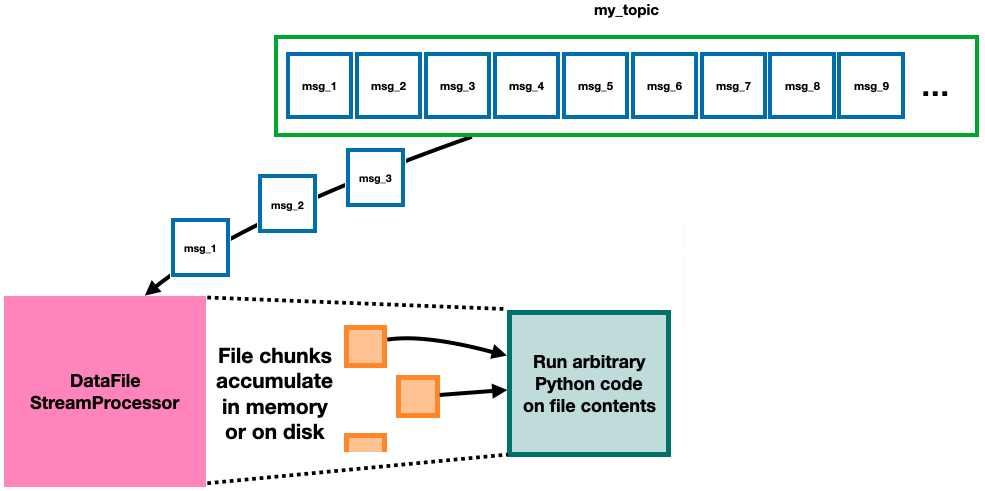

=======================
DataFileStreamProcessor
=======================

A DataFileStreamProcessor is a useful base class that can be extended to run arbitrary Python code on whole data files as they're reconstructed from messages on a Kafka topic. The :class:`~.S3TransferStreamProcessor` class is one example of an implemented DataFileStreamProcessor.

The main function that users will need to write to instantiate DataFileStreamProcessor-type classes is :func:`openmsistream.DataFileStreamProcessor._process_downloaded_data_file`, which will do the actual desired processing for each reconstructed data file. Running the class using the :class:`~.utilities.Runnable` workflow also requires writing a :func:`openmsistream.utilities.Runnable.run_from_command_line` function.

The first argument to the :func:`openmsistream.DataFileStreamProcessor._process_downloaded_data_file` function is a :class:`~.data_file_io.DownloadDataFileToMemory` object holding a file that has been fully reconstructed from chunks in a topic. The content of the file can be accessed using its :attr:`bytestring` attribute. The second argument to that function is a :class:`threading.Lock` object that can be used to ensure only one instance of the processing function is running at a time even though multiple consumer threads may be running. The processing function should return None if it completes successfully, otherwise it should return a caught :class:`Exception` object. 

The :func:`openmsistream.utilities.Runnable.run_from_command_line` function is a class method that should be written like a script to run the class end-to-end. In that function, a user can call :func:`openmsistream.utilities.Runnable.get_argument_parser` to get the command-line argument parser to use. If a user would like to add additional command line arguments for the extended class they can implement the :func:`openmsistream.utilities.Runnable.get_command_line_arguments` class method. Command line arguments already defined include the config file, topic name, number of consumer threads, and output location; they can be picked up by calling :func:`super().get_command_line_arguments` in the extended class.

With a :func:`openmsistream.utilities.Runnable.run_from_command_line` function defined, adding a block like this::

    def main() :
        ClassName.run_from_command_line()

    if __name__=='__main__' :
        main()

to the bottom of the file will allow the class to be run as a module, with::

    >>> python -m path.to.class.file [arguments]

Please see :doc:`the page about the S3TransferStreamProcessor <../main_programs/s3_transfer_stream_processor>` to better understand the structure of the logging files that a DataFileStreamProcessor-type program will create, how offsets are manually committed, and guarantees for restarting in the case of an abrupt shutdown of the program.