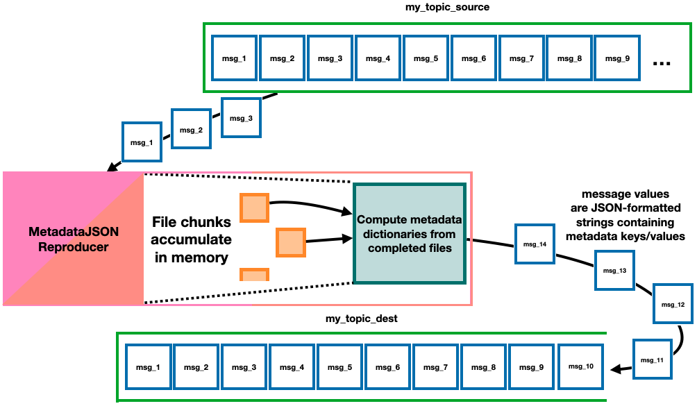

======================
MetadataJSONReproducer
======================

A MetadataJSONReproducer is a base class that can be extended to extract a dictionary of metadata keys and values from data files as they're reconstructed from a Kafka topic, and then "re-produce" those metadata dictionaries to a different topic as JSON-formatted strings. A user only needs to write one function in classes extending MetadataJSONReproducer to run the workflow defined by this base class. 

The main function that users will need to write to instantiate their own MetadataJSONReproducer-type classes is :func:`openmsistream.MetadataJSONReproducer._get_metadata_dict_for_file`, which will compute the metadata dictionary for each reconstructed data file as they become available. The argument to that function is an :class:`~.data_file_io.DownloadDataFileToMemory` object holding a file that has been fully reconstructed from chunks in a topic; the content of the file can be accessed using its :attr:`bytestring` attribute. The function should return a dictionary of metadata keys and values when successful, but it can safely raise Exceptions or log warnings if necessary (Exceptions raised will be logged without crashing the program).

If a user would like to add additional command line arguments for the extended class they can also implement the :func:`openmsistream.utilities.Runnable.get_command_line_arguments` class method. Command line arguments already defined include the config file, consumer and producer topic names/numbers of threads, and output location; they can be picked up by calling :func:`super().get_command_line_arguments` in the extended class.

Adding a block like this::

    def main() :
        ClassName.run_from_command_line()

    if __name__=='__main__' :
        main()

to the bottom of the file will allow the class to be run as a module, with::

    >>> python -m path.to.class.file [arguments]

Please see :doc:`the page about the S3TransferStreamProcessor <../main_programs/s3_transfer_stream_processor>` to better understand the structure of the logging files that a MetadataJSONReproducer-type program will create, how offsets are manually committed, and guarantees for restarting in the case of an abrupt shutdown of the program.