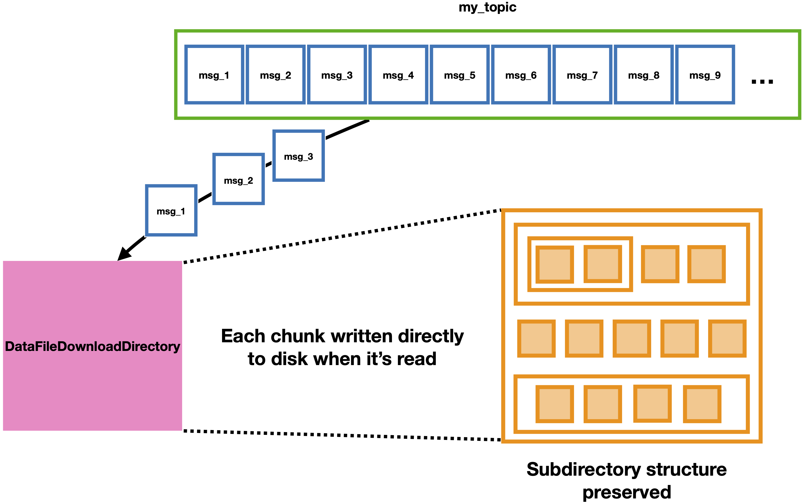

=========================
DataFileDownloadDirectory
=========================

This module subscribes a group of consumers to a topic on a broker and passively listens in several parallel threads for messages that are chunks of data files. It reconstructs files produced to the topic from their individual chunks and puts the reconstructed files in a specified directory, preserving any subdirectory structure on the production end. To run it in the most common use case, enter the following command and arguments::

    DataFileDownloadDirectory [working_directory_path] --config [config_file_path] --topic_name [topic_name]

where:

* ``[working_directory_path]`` is the path to the directory that the reconstructed files should be put in (if it doesn't exist it will be created), 
* ``[config_file_path]`` is the path to a config file including at least ``[broker]`` and ``[consumer]`` sections, and 
* ``[topic_name]`` is the name of the topic to subscribe to/consume messages from. 

Options for running the code include:

#. Changing the number of parallel threads: add the ``--n_threads [threads]`` argument where ``[threads]`` is the desired number of parallel threads to use (and, also, the number of consumers used in the group). The default is 2 threads/consumers; increasing this number may give Kafka warnings or errors depending on how many consumers can be subscribed to a particular topic (generally you can use as many threads as there are partitions to the topic).
#. Changing the consumer group ID: add the ``--consumer_group_id [group_id]`` argument where ``[group_id]`` is the string to use for the Consumer group ID. The default creates a new ID every time, but if you would like to keep track of which messages have already been consumed you can choose a consistent group ID to use every time, and only messages whose offsets haven't been comitted yet will be consumed. Please see the `documentation for Kafka Consumers here <https://docs.confluent.io/platform/current/clients/consumer.html>`_ for more details if consumer offset commits are unfamiliar to you.

To see other optional command line arguments, run ``DataFileDownloadDirectory -h``.

Interacting with the program
----------------------------

While the main process is running, a line with a "." character will be printed out periodically to indicate the process is still alive. At any time, typing "check" or "c" into the console will print a message specifying how many total messages have been read and how many files have been completely reconstructed. When all the messages for a single file have been received and the file is completely reconstructed, a message will be printed to the console saying what file it was. The processes can be shut down at any time by typing "quit" or "q" into the console.

Consumer offset commits
-----------------------

OpenMSIStream manually registers Consumer offset commits to guarantee that every message is received and written to disk "at least once." This guarantee is only valid if ``enable.auto.commit = False`` is set in the ``[consumer]`` section of the config file used. If this parameter isn't set to enable the "at least once" guarantee a warning will be logged, and it's possible that some messages may be dropped or consumed multiple times from the topic.
