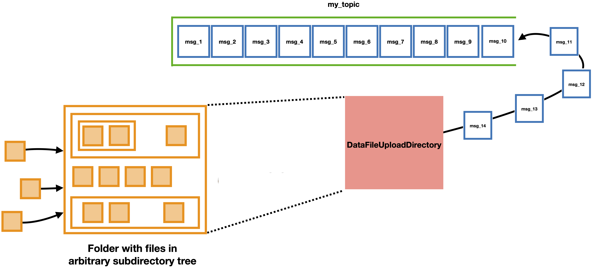

=======================
DataFileUploadDirectory
=======================

This module uploads any files that are added to a given directory to a topic on a broker by breaking them into chunks and producing those chunks as messages. It preserves subdirectory structure relative to the watched directory. To run it in the most common use case, enter the following command and arguments::

    DataFileUploadDirectory [directory_path] --config [config_file_path] --topic_name [name_of_topic]

where:

* ``[directory_path]`` is the path to a directory to monitor for files to upload, 
* ``[config_file_path]`` is the path to a config file including at least ``[broker]`` and ``[producer]`` sections, and 
* ``[topic_name]`` is the name of the topic to produce to. 

Running the code will automatically enqueue any files added to the directory during runtime to be produced. If you would like to upload files that already exist in the directory when the program is started up, add the ``--upload_existing`` flag; otherwise only new files added will be uploaded.

Other options for running the code include:

#. Changing the number of parallel threads: add the ``--n_threads [threads]`` argument where ``[threads]`` is the desired number of parallel threads to use. The default is 2 threads.
#. Changing which files in the directory get uploaded: add the ``--upload_regex [regex]`` argument where ``[regex]`` is a regular expression. Only files whose paths match ``[regex]`` will be uploaded. The default excludes any hidden files (names start with '.') and log files (names end with '.log'). Hidden files and files in the "LOGS" subdirectory will never be uploaded.
#. Uploading existing files as well as newly-added files: add the ``--upload_existing`` flag (see above).
#. Changing the size of the individual file chunks: add the ``--chunk_size [n_bytes]`` argument where ``[n_bytes]`` is the desired chunk size in bytes. ``[n_bytes]`` must be a nonzero power of two (the default is 16384). It may be necessary to reconfigure the topic you're using as well as some of the Producer configurations to allow particularly large messages.
#. Changing the size of the internal message queue: add the ``--queue_max_size [n_megabytes]`` argument where ``[n_megabytes]`` is the maximum allowed size of the internal queue in megabytes (the default is 500MB). This internal queue is used to make sure that there's some buffer between recognizing a file exists to be uploaded and producing all of its associated messages to the topic; its size should be set somewhere between a few batches of messages ("``batch.size``" in the producer config) and the maximum memory footprint you would like the program to have. The default value is 500MB. If possible, it's preferable to set this value at least as large as the librdkafka buffering queue ("``queue.buffering.max.kbytes``" in the producer config) to minimize latency, but the total memory footprint is approximately the sum of both queues, and the default librdkafka queue size is about 1GB.

To see other optional command line arguments, run ``DataFileUploadDirectory -h``.

Interacting with the program
----------------------------

While the main process is running, a line with a "." character will be printed out periodically to indicate the process is still alive. At any time, typing "check" or "c" into the console will print a message specifying how many total files have been enqueued or are in progress. Debug-level logging messages show how many chunks each file is broken into, and the progress of actually producing those chunks to the topic. 

The processes can be shut down by typing "quit" or "q" into the console. Note that the process won't actually shut down until all currently enqueued messages have been delivered to the broker (or return unrecoverable errors). Also note that the files will have all of their chunks enqueued almost immediately, but actually producing the chunks to the broker may take slightly more time depending on how many files are being uploaded at once.

Heartbeat messages
------------------

If configured as described on the main program page, the heartbeat messages sent by a DataFileUploadDirectory will contain fields for the number of messages and bytes produced since the previous heartbeat message was sent. The fields in the JSON-formatted string value of each message are called "``n_messages_produced``", "``n_bytes_produced``".

Directory monitoring with watchdog
----------------------------------

The upload directory uses a Python library called `watchdog <https://pypi.org/project/watchdog/>`_ to monitor the filesystem for events that would trigger files to be uploaded. The implementation is purposefully minimal to reflect the limitations of using sub/pub messaging systems to reconstruct directories on disparate machines: specifically, ``DataFileUploadDirectory`` programs are "append-only" in that they will never send messages to delete certain files.

For example, if you move a bunch of files to a new subdirectory while the program is running, the consumer side will get new messages for the files in the subdirectory, but any reconstructed files in the original location will remain. Any files that are modified will be produced again; deleting files does not send any new messages. Because many common editing programs (such as vim) use short-lived temporary files to maintain atomicity of their outputs, files are not be marked to be produced until they have existed unmodified for 3 seconds (by default). Files that are created and deleted within those three seconds will not be produced. The default 3 second lag time is configurable from the command line using the ``--watchdog_lag_time`` argument.

On Windows platforms, watchdog monitors directories using ReadDirectoryChangesW by default. But that notifier doesn't perform reliably on networked drives, or really on any filesystems that's not NTFS. In those cases, Microsoft recommends keeping periodic snapshots of directory contents and comparing with them to find changes in directory trees. Watchdog `implements a fallback solution to do this<https://github.com/gorakhargosh/watchdog?tab=readme-ov-file#about-using-watchdog-with-cifs>`_ (called a ``PollingObserver``), but it's more memory-intensive and less performant. To use that alternate observer in a ``DataFileUploadDirectory``, add the ``--use_polling_observer`` flag.

Users who would like to test a particular workflow's interaction with watchdog can use the `testing script <https://github.com/openmsi/openmsistream/blob/main/test/watchdog_testing.py>`_ in the repository to see what events get triggered when. There is also `an alternate version <https://github.com/openmsi/openmsistream/blob/main/test/watchdog_testing_polling_observer.py>`_ that uses the ``PollingObserver``. Running one of those scripts pointed to a directory will log messages for each recognized watchdog event. Only events for files are relevant for OpenMSIStream.

Restarting the program
----------------------

Using a ``DataFileUploadDirectory`` to Produce chunks of files to the broker is robust if the code crashes and can be restarted. By default, a special subdirectory called "LOGS" is created in ``[directory_path]`` when the code starts up (any files added to the "LOGS" subdirectory will not be uploaded). That subdirectory will include the log file, as well as one file called "``upload_to_[name_of_topic]_in_progress.csv``" and one (or several) more called something like "``uploaded_to_[name_of_topic].csv``". The .csv files are special datatable files that list the chunks of each recognized file that still need to be uploaded and information about files that have been fully uploaded, respectively. The location these files end up in is configurable using the "``--logger_file_path``" command line option.

The list of chunks uploaded for each file is updated atomically upon receipt of a positive acknowledgment callback from the broker: chunks are not listed as uploaded until they have been fully received and acknowledged by the broker and therefore guaranteed to exist on the topic. When ``DataFileUploadDirectory`` is restarted pointing to the same directory and topic, any files that did not get fully uploaded will have their missing chunks re-enqeued for upload if they still exist in the same location. 

If the same file is produced multiple times to the same topic, it will appear multiple times in the "fully_uploaded" file(s). Files uploaded to different topics from the same directory will have their own independent .csv files. The files are atomic and accurate to within 5 seconds. You can copy and then browse them while the code is running to check which files have been fully uploaded or recognized. There may be multiple "``uploaded_to_*.csv``" files at once: one per upload thread, with a maximum of 1,000 entries each. Splitting these files up keeps the atomic updates relatively efficient and prevents unnecessary thread blocking. The files can be concatenated together manually in between runs, and they will be automatically consolidated at the beginning of each run (or end of each run, if the program is stopped using the "quit" command).
