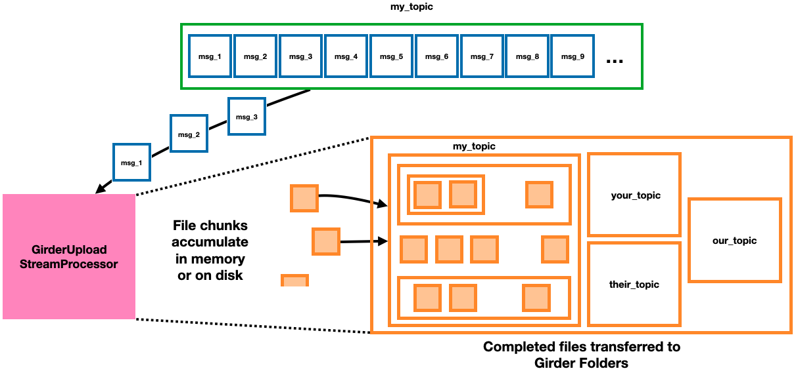

===========================
GirderUploadStreamProcessor
===========================

`Girder <https://girder.readthedocs.io/en/latest/index.html>`_ is a free and open source platform designed to simply implement data organization and dissemination, user management and authentication, and authorization management as a web-based standalone application or backend for other services. The NSF-funded Data Infrastructure Building Block initiative `Whole Tale <https://wholetale.org/>`_, for example, uses a Girder backend for data storage and access management.

The ``GirderUploadStreamProcessor`` module reads messages from a topic to build up data files in memory or on disk, and then uploads complete files to Folders in a Girder instance using requests to the Girder REST API. If files were originally produced using a ``DataFileUploadDirectory``, then the subdirectory structure relative to the root directory will be preserved relative to a configurable Folder in Girder. Metadata fields are added to Files and Folders specifying the version tag of OpenMSIStream that's running, the name of the topic from which files are being consumed, and the hex digest of the sha256 hash for each file uploaded.

The :class:`~.GirderUploadStreamProcessor` is a specific type of :class:`~.DataFileStreamProcessor`.

Running the program
-------------------

To run the program in the most common use case, enter the following command and arguments::

    GirderUploadStreamProcessor [girder_api_url] [girder_api_key] --config [config_file_path] --topic_name [topic_name] --girder_root_folder_id [root_folder_id]

where:

* ``[girder_api_url]`` is the URL of a Girder instance's REST API endpoint
* ``[girder_api_key]`` is an API key generated for interacting with that Girder instance
* ``[config_file_path]`` is the path to a config file including at least ``[broker]`` and ``[consumer]`` sections 
* ``[topic_name]`` is the name of the topic to subscribe to/consume messages from, and
* ``[girder_root_folder_id]`` is the model ID of the Folder in Girder relative to which files should be uploaded. If the desired root folder doesn't already exist in the Girder instance or its ID is unknown, the ``--collection_name`` and/or ``--girder_root_folder_path`` arguments can be used instead to specify a Collection and the path to a Folder that will be created if they don't already exist.

Other options for running the code include:

#. Changing the number of parallel threads: add the ``--n_threads [threads]`` argument where ``[threads]`` is the desired number of parallel threads to use (and, also, the number of consumers used in the group). The default is 2 threads/consumers; increasing this number may give Kafka warnings or errors depending on how many consumers can be subscribed to a particular topic (generally you can use as many threads as there are partitions to the topic).
#. Changing the consumer group ID: add the ``--consumer_group_id [group_id]`` argument where ``[group_id]`` is the string to use for the Consumer group ID. The default creates a new ID every time, but if you would like to keep track of which messages have already been consumed you can choose a consistent group ID to use every time, and only messages whose offsets haven't been comitted yet will be consumed. Please see the `documentation for Kafka Consumers here <https://docs.confluent.io/platform/current/clients/consumer.html>`_ for more details if consumer offset commits are unfamiliar to you.
#. Changing which files get processed: add the ``--download_regex [regex]`` argument where ``[regex]`` is a regular expression string that matches the relative filepath of every file you would like to process. Messages from files whose relative paths don't match the regex will be read from the topic but skipped.
#. Putting the logs and registry .csv files in a custom location: add the ``--output_dir [output_dir]`` argument, where ``[output_dir]`` is the path to a directory where the output should be saved (it will be created if it doesn't exist yet). By default the output is written to a directory called ``GirderUploadStreamProcessor_output`` in the current working directory.
#. Changing how files are downloaded: add the ``--mode [mode]`` argument, where ``[mode]`` is "``memory``", "``disk``", or "``both``". In "memory" mode (the default), files are reconstructed only in memory before being uploaded, which is fastest. In "disk" mode, files are instead written to disk with the output directory as their root directory, which is useful if the reconstructed files are too large to hold more than one in memory at once. In "both" mode, files are written to disk and held in memory, which is useful to perform transfers quickly while still writing out local copies of files.

To see other optional command line arguments, run ``GirderUploadStreamProcessor -h``.

Interacting with the program
----------------------------

While the main process is running, a line with a "." character will be printed out periodically to indicate the process is still alive. At any time, typing "check" or "c" into the console will print a message specifying how many total messages have been read and how many files have been uploaded to Girder. The processes can be shut down at any time by typing "quit" or "q" into the console.

Consumer offset commits
-----------------------

OpenMSIStream manually commits Consumer offsets to guarantee that every message is received "at least once." This guarantee is only valid if ``enable.auto.commit = False`` is set in the ``[consumer]`` section of the config file used. If this parameter isn't set to enable the "at least once" guarantee a warning will be logged, and it's possible that some messages may be dropped or consumed multiple times from the topic.

Heartbeat messages
------------------

If configured as described on the main program page, the heartbeat messages sent by a GirderUploadStreamProcessor will contain fields for the number of messages and bytes read (consumed from the topic) and processed (uploaded to Girder) since the previous heartbeat message was sent. The fields in the JSON-formatted string value of each message are called "``n_messages_read``", "``n_bytes_read``", "``n_messages_processed``", and "``n_bytes_processed``".

Restarting the program
----------------------

Using a ``GirderUploadStreamProcessor`` (and any other program whose underlying class inherits from :class:`~.DataFileStreamProcessor`) is robust if the code crashes and can be restarted. By default, the output directory includes a ``LOGS`` subdirectory, which holds a log file as well as a file called "``consuming_from_[name_of_topic]_by_[consumer_group_ID]_in_progress.csv``" and one or several files with the pattern "``processed_from_[name_of_topic]_by_[consumer_group_ID]*.csv``". The .csv files are special datatable files (they can be read as :class:`~.utilities.DataclassTable` objects) that list the processing status of each recognized file and information about files that have been successfully uploaded, respectively. To decrease latency, there may be several files listing the processing results: one per thread, capped at 1,000 entries each. When the program is shut down normally or restarted, these files will be automatically concatenated. You can also concatenate them by hand when the program is not running. The location these files end up in is configurable using the "``--logger_file_path``" command line argument.

The status of each file is updated atomically upon receipt of each message. If any files fail to be uploaded during a run, or the program quits or crashes before all the messages for a file are received, a new run of ``GirderUploadStreamProcessor`` restarted with the same consumer group ID and configs will restart the consumers from the beginning of the topic and read only messages from those failed files until they catch up to where they would be otherwise. As long as all messages for the failed files still exist in the same topic, restarting will select and try uploading them again.

If the same file is produced multiple times to the same topic, it will appear multiple times in the "successfully_processed" file. Files uploaded to different topics from the same directory, or consumed by a group of consumers with a different group ID, will have their own independent .csv files. The files are atomic and accurate to within 5 seconds. You can copy and then browse them while the code is running to check which files have been uploaded or recognized.
