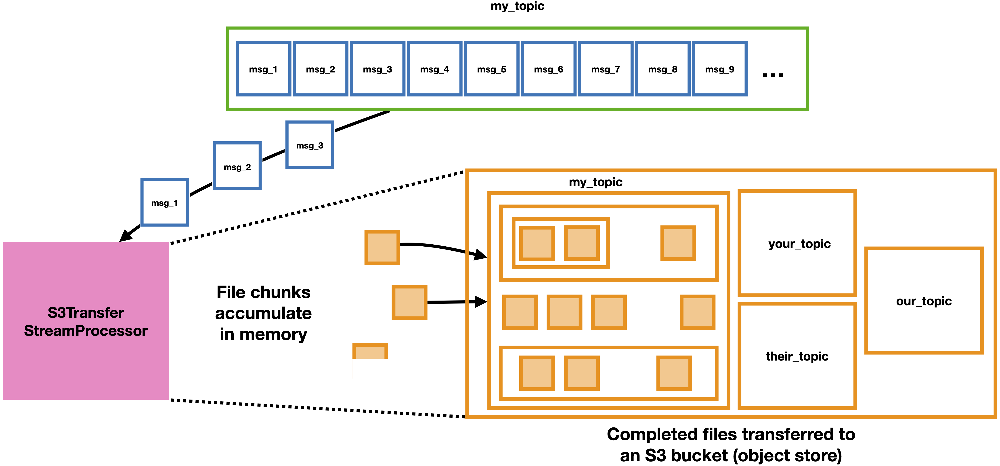

=========================
S3TransferStreamProcessor
=========================

This module reads messages from a topic to build up data files in memory, and then uploads complete files into an S3 object store bucket. Downloaded data files will be added to the bucket under a subdirectory named after the topic from which they were consumed, and will replicate the subdirectory structure relative to a root watched directory if they were produced using ``DataFileUploadDirectory``. 

The :class:`~.S3TransferStreamProcessor` is a specific type of :class:`~.DataFileStreamProcessor`.

Extra configs needed
--------------------

The user must specify some information on how to connect to the S3 bucket endpoint by adding a new section called ``[s3]`` to the config file used. The parameters that must be specified in this section of the config file are:

* ``access_key_id``: essentially the user name to use when connecting to the bucket through the S3 API
* ``secret_key_id``: essentially the password associated with the access key id (it may be best to supply this as an environment variable rather than hard code it)
* ``endpoint_url``: the URL used to access the S3 bucket (without the bucket name) 
* ``region``: the region where the S3 bucket is located

An example configuration file with an ``[s3]`` section `can be found in the repo here <https://github.com/openmsi/openmsistream/blob/main/openmsistream/kafka_wrapper/config_files/test_s3_transfer.config>`_; all the relevant parameters in that example are supplied as environment variables.

Running the program
-------------------

To run the program in the most common use case, enter the following command and arguments::

    S3TransferStreamProcessor [bucket_name] --config [config_file_path] --topic_name [topic_name]

where:

* ``[bucket_name]`` is the name of the bucket into which files should be consumed (the rest of the bucket connection information is specified :ref:`in the config file used <Extra configs needed>`)
* ``[config_file_path]`` is the path to a config file including at least ``[broker]``, ``[consumer]``, and ``[s3]`` sections, and 
* ``[topic_name]`` is the name of the topic to subscribe to/consume messages from. 

Other options for running the code include:

#. Changing the number of parallel threads: add the ``--n_threads [threads]`` argument where ``[threads]`` is the desired number of parallel threads to use (and, also, the number of consumers used in the group). The default is 2 threads/consumers; increasing this number may give Kafka warnings or errors depending on how many consumers can be subscribed to a particular topic (generally you can use as many threads as their are partitions to the topic).
#. Changing the consumer group ID: add the ``--consumer_group_id [group_id]`` argument where ``[group_id]`` is the string to use for the Consumer group ID. The default creates a new ID every time, but if you would like to keep track of which messages have already been consumed you can choose a consistent group ID to use every time, and only messages whose offsets haven't been comitted yet will be consumed. Please see the `documentation for Kafka Consumers here <https://docs.confluent.io/platform/current/clients/consumer.html>`_ for more details if consumer offset commits are unfamiliar to you.
#. Putting the logs and registry .csv files in a custom location: add the ``--output_dir [output_dir]`` argument, where ``[output_dir]`` is the path to a directory where the output should be saved (it will be created if it doesn't exist yet). By default the output is written to a directory called ``S3TransferStreamProcessor_output`` in the current working directory.

To see other optional command line arguments, run ``S3TransferStreamProcessor -h``.

Interacting with the program
----------------------------

While the main process is running, a line with a "." character will be printed out periodically to indicate the process is still alive. At any time, typing "check" or "c" into the console will print a message specifying how many total messages have been read and how many files have been transferred to the S3 bucket. When all the messages for a single file have been received and the file is transferred to the bucket, a message will be printed to the console saying what file it was and the result of the validation of its contents as read from the bucket with the original file contents read from disk at production time. The processes can be shut down at any time by typing "quit" or "q" into the console.

Consumer offset commits
-----------------------

OpenMSIStream manually commits Consumer offsets to guarantee that every message is received "at least once." This guarantee is only valid if ``enable.auto.commit = False`` is set in the ``[consumer]`` section of the config file used. If this parameter isn't set to enable the "at least once" guarantee a warning will be logged, and it's possible that some messages may be dropped or consumed multiple times from the topic.

Restarting the program
----------------------

Using an ``S3TransferStreamProcessor`` to transfer files stored as chunks on the broker (and any other program whose underlying class inherits from :class:`~.DataFileStreamProcessor`) is robust if the code crashes and can be restarted. The output directory includes a log file, as well as a file called "``consuming_from_[name_of_topic]_by_[consumer_group_ID]_in_progress.csv``" and one or several files with the pattern "``processed_from_[name_of_topic]_by_[consumer_group_ID]*.csv``". The .csv files are special datatable files (they can be read as :class:`~.utilities.DataclassTable` objects) that list the processing status of each recognized file and information about files that have been successfully transferred, respectively. To decrease latency, there may be several files listing the processing results: one per thread, capped at 1,000 entries each. When the program is shut down normally or restarted, these files will be automatically concatenated. You can also concatenate them by hand when the program is not running.

The status of each file is updated atomically upon receipt of each message. If any files fail to be transferred during a run, or the program quits or crashes before all the messages for a file are received, a new run of ``S3TransferStreamProcessor`` restarted with the same consumer group ID and configs will restart the consumers from the beginning of the topic and read only messages from those failed files until they catch up to where they would be otherwise. As long as all messages for the failed files still exist in the same topic, restarting will select and try processing them again.

If the same file is produced multiple times to the same topic, it will appear multiple times in the "successfully_processed" file. Files uploaded to different topics from the same directory, or consumed by a group of consumers with a different group ID, will have their own independent .csv files. The files are atomic and accurate to within 5 seconds. You can copy and then browse them while the code is running to check which files have been transferred or recognized.
