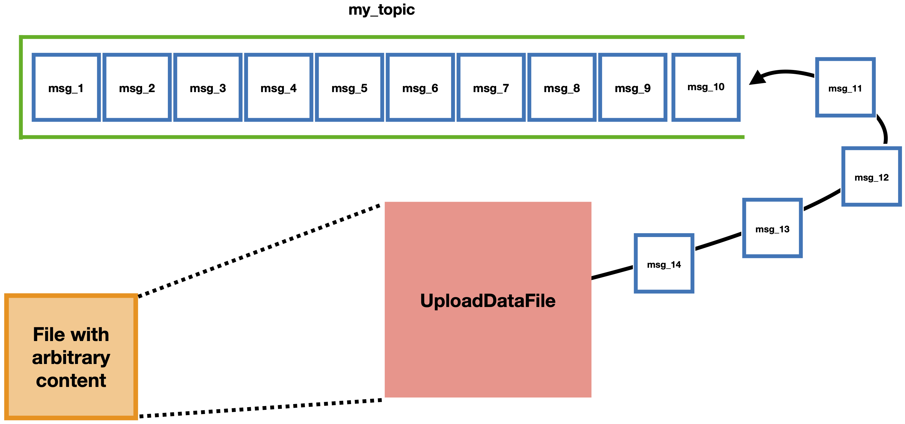

==============
UploadDataFile
==============

This module uploads a single specified file to a topic on a broker by breaking it into chunks of a particular size and uploading those chunks in several parallel threads. To run it in the most common use case, enter the following command and arguments::

    UploadDataFile [file_path] --config [config_file_path] --topic_name [topic_name]

where:

* ``[file_path]`` is the path to the text file to upload, 
* ``[config_file_path]`` is the path to a config file including at least ``[broker]`` and ``[producer]`` sections, and 
* ``[topic_name]`` is the name of the topic to produce to. 

Running the code will produce all the chunks of the single file to the topic; the process will hang until the broker acknowledges receipt of delivery for every message that was produced.

Options for running the code include:

#. Changing the maximum number of parallel threads allowed to run at a time: add the ``--n_threads [threads]`` argument where ``[threads]`` is the desired number of parallel threads to allow (the default is 2 threads).
#. Changing the size of the individual file chunks: add the ``--chunk_size [n_bytes]`` argument where ``[n_bytes]`` is the desired chunk size in bytes. ``[n_bytes]`` must be a nonzero power of two (the default is 16384). It may be necessary to reconfigure the topic you're using as well as some of the Producer configurations to allow particularly large messages.

To see other optional command line arguments, run ``UploadDataFile -h``.
